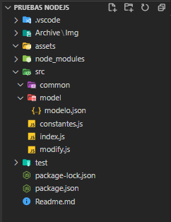

# Ejercicio de Formacion de JavaScript y NodeJs
## Descripcion de la tarea
Creamos un proyeto con la sigiente estructura:

En el se deben realizar una serie de modificaciones para obtener el Json corespondiente
## Tecnologias utilizadas
    -JavaScript
    -NodeJs
## Libreria utilizada durante el desarrollo
-[Lodash](https://lodash.com/)